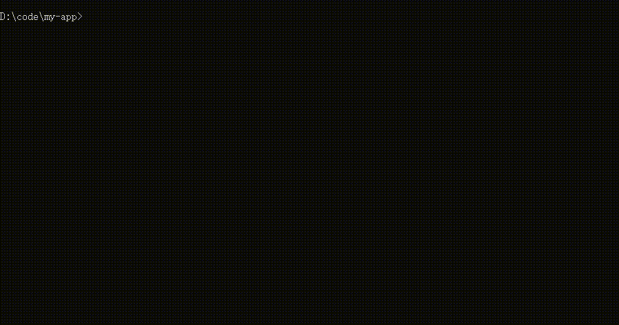
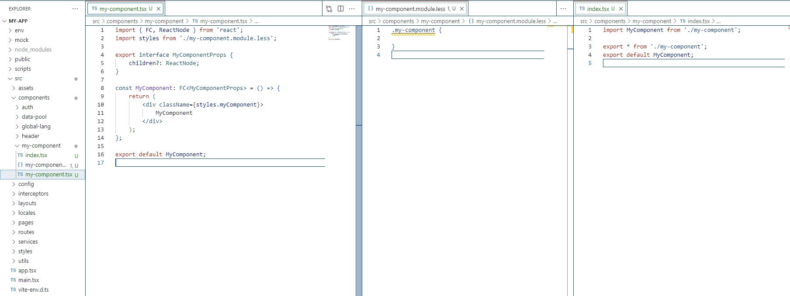

<div align="center"><a name="readme-top"></a>

<h3>SeaLion Client is a toolkit for building front-end projects and code</h3>

<br/>

<div>


</div>
</div>

English· [简体中文](https://github.com/OpenSealion/sealion-client/blob/develop/README.md)

# Quick Start

### Create project

```sh
slc create my-app
cd my-app
npm run dev

```

<div>
Open <code>http://localhost:5173</code> to view.<br/>
When you are ready to deploy to a production environment,Run <code>npm run build</code> to generate the compressed bundle.
</div>

<br/>

### Create React component

```sh
slc g -c my-component
```

<br/>
This creates the my-component component in the current directory.<br/><br/>

# Feature

- Template technology stack: react + typescript + less;
- You can choose vite or webpack as the packaging tool;
- Basic component materials can be created quickly.

# Install

```sh
# mac and ubuntu need to add sudo
npm install -g sea-lion-client
```
<br/>

# Function

<br/>

## Create app

```sh
slc create my-app

```
The project directory is as follows (the default template is used as an example to list common files)

```
my-app
├── env
├── mock
├── node_modules
├── public
├── script
├── vite.config.ts
├── index.html
└── src
    ├── assets          # Static resources
    ├── components      # Project Common Components
    ├── config          # Configuration files for similar permission functions
    ├── interceptors    # response & request middleware, based on axios development
    ├── layouts         # Layout components
    ├── locales         # Internationalized Text Materials
    ├── routes          # Routers
    ├── services        # Interface request function
    └── styles          # Project Common Style
    └── utils           # Tool Function
    └── app.tsx
    └── main.tsx       
    └── vite-env.d.ts
```

<br/>
Use the template to create the app

```sh
# Create my-app using template @sea-lion/app-template
slc create my-app -t @sea-lion/app-vite-template

```
Template Options
<table>
   <tbody>
    <tr>
        <td>Template</td>
        <td>Function</td>
        <td>Note</td>
    </tr>
    <tr>
        <td><a href="https://www.npmjs.com/package/@sea-lion/app-template" target="_blank">@sea-lion/app-vite-template</a></td>
        <td>Project development environment built with vite</td>
        <td>Default template, recommended</td>
    </tr>
    <tr>
        <td><a href="https://www.npmjs.com/package/@sea-lion/app-template" target="_blank">@sea-lion/lib-template</a></td>
        <td>Project development environment built with rollup</td>
        <td></td>
    </tr>
    <tr>
        <td><a href="https://www.npmjs.com/package/@sea-lion/app-template" target="_blank">@sea-lion/app-template</a></td>
        <td>Project development environment built with webpack5</td>
        <td>Stop Maintenance</td>
    </tr>
   </tbody> 
</table>

<br/>

## Create component

```sh
cd ./src/components
slc g -c my-component
```
<br/>
The generator is shown in the figure below. When using slc to create materials and projects, slc first performs a rename file validation in the current directory to avoid overwriting.
<br/>

<br/>
<br/>
<br/>

## View Version

```sh
slc -v
```
<br/>

# Development

Install dependencies
```
lerna bootstrap
```
<br/>

Run locally
```sh
node packages/sea-lion-client/bin/sea-lion-client.js create [app-name]
```
