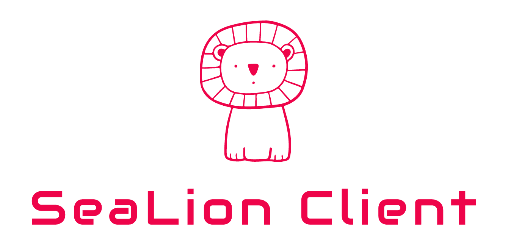
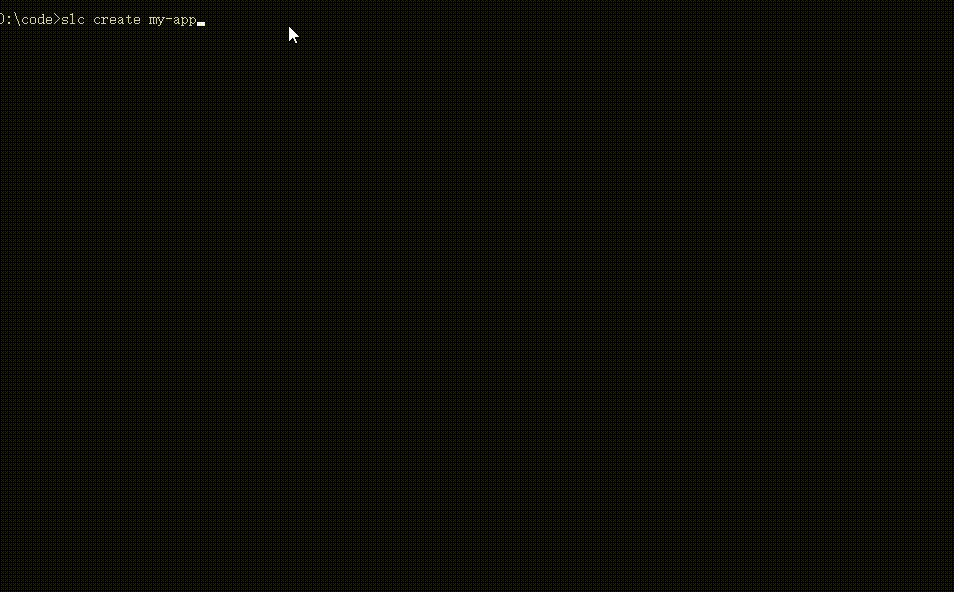
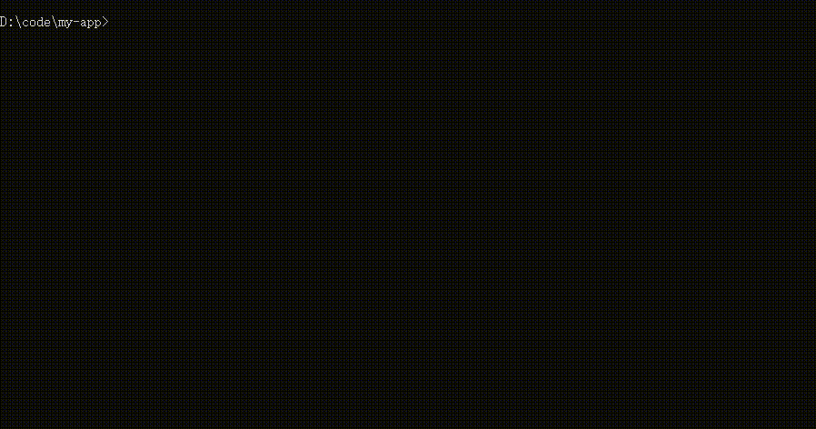
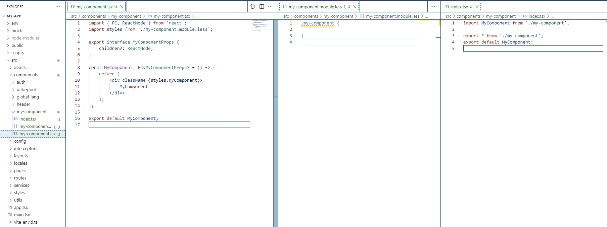

<div align="center"><a name="readme-top"></a>


<h3>SeaLion Client是一款构建前端项目和代码的工具包</h3>
<br/>
<div>


</div>
</div>

# 快速使用
### 创建项目

```sh
slc create my-app
cd my-app
npm run dev

```

<div>
打开 <code>http://localhost:5173</code> 查看。<br/>
当你准备部署到生产环境时，执行<code>npm run build</code>生成压缩的bundle。
</div>
<br/>

### 创建React组件
```sh
slc g -c my-component
```

<br/>
执行后会在当前目录下创建my-component组件<br/><br/>

# 特性
- 模板技术栈：react + typescript + less；
- 可以选择vite或者webpack做为打包工具；
- 可以快速创建基础组件物料。

# 安装
```sh
# mac和ubuntu需要加sudo
npm install -g sea-lion-client
```
<br/>


# 功能
<br/>

## 创建app
```sh
slc create my-app

```
项目目录如下（以默认模板为例，列出常用文件）

```
my-app
├── env
├── mock
├── node_modules
├── public
├── script
├── vite.config.ts
├── index.html
└── src
    ├── assets          # 静态资源
    ├── components      # 项目通用组件
    ├── config          # 类似权限功能的配置文件
    ├── interceptors    # response & request 中间件，基于axios开发
    ├── layouts         # 布局组件
    ├── locales         # 国际化文字物料
    ├── routes          # 路由
    ├── services        # 接口请求函数
    └── styles          # 项目通用样式
    └── utils           # 工具函数
    └── app.tsx
    └── main.tsx       
    └── vite-env.d.ts
```

<br/>
传入模板创建app

```sh
# 使用模板@sea-lion/app-template创建my-app
slc create my-app -t @sea-lion/app-vite-template

```
模板可选项
<table>
   <tbody>
    <tr>
        <td>模板</td>
        <td>功能</td>
        <td>备注</td>
    </tr>
    <tr>
        <td><a href="https://www.npmjs.com/package/@sea-lion/app-template" target="_blank">@sea-lion/app-vite-template</a></td>
        <td>使用vite构建的项目开发环境</td>
        <td>默认模板，推荐使用</td>
    </tr>
    <tr>
        <td><a href="https://www.npmjs.com/package/@sea-lion/app-template" target="_blank">@sea-lion/lib-template</a></td>
        <td>使用rollup构建的库开发环境</td>
        <td></td>
    </tr>
    <tr>
        <td><a href="https://www.npmjs.com/package/@sea-lion/app-template" target="_blank">@sea-lion/app-template</a></td>
        <td>使用webpack5构建的项目开发环境</td>
        <td>不再维护</td>
    </tr>
   </tbody> 
</table>

<br/>

## 创建组件

```sh
cd ./src/components
slc g -c my-component
```
<br/>
生成物如下图所示，当使用slc创建物料和项目时，slc首先会在当前目录下进行重名文件效验，避免覆盖。
<br/>

<br/>
<br/>
<br/>

## 查看版本
```sh
slc -v
```
<br/>

# 开发

安装依赖
```
lerna bootstrap
```
<br/>

本地运行
```sh
node packages/sea-lion-client/bin/sea-lion-client.js create [app-name]
```
